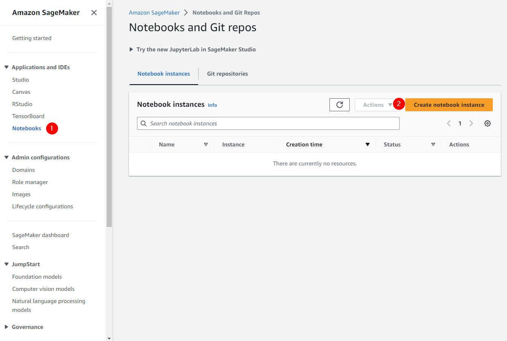
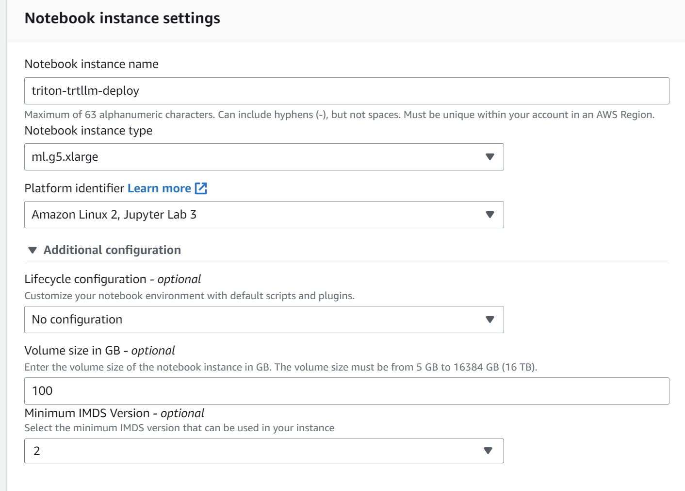
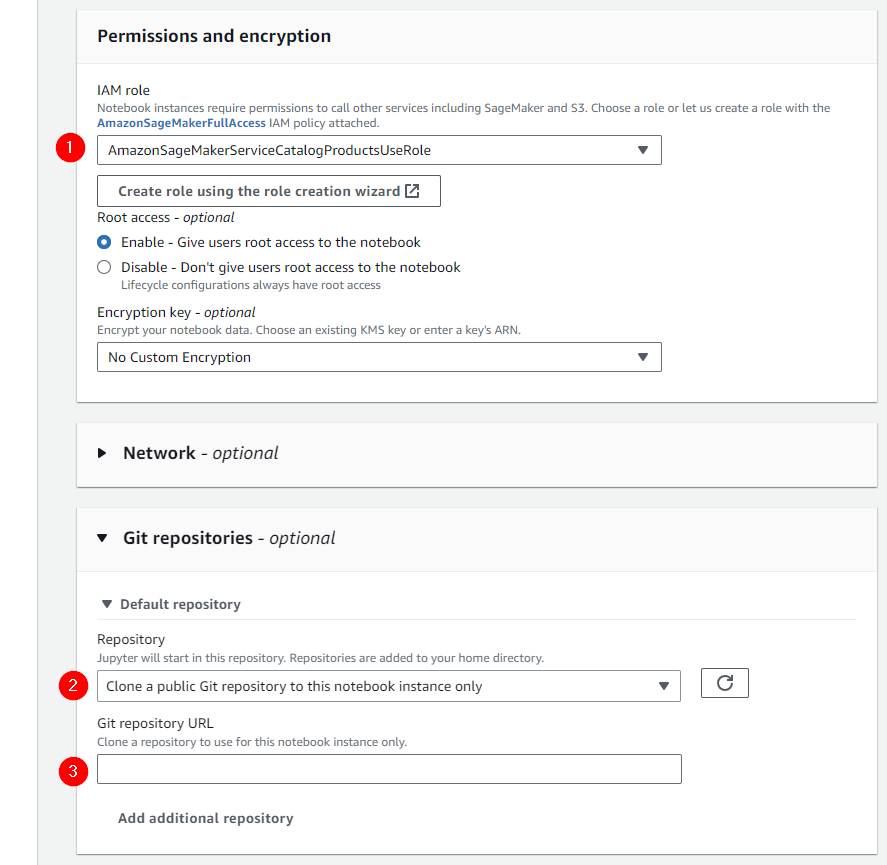

# Triton TensorRT-LLM on Amazon SageMaker Examples

## AWS Sagemaker Notebook Configuration

- Login to AWS and navigate to the **Amazon Sagemaker** service

- Configure a SageMaker notebook using instance type `g5.xlarge`
 

- Configure the instance with enough storage to accommodate container image pull(s) and model weights - `100GB` should be adequate
 

- Ensure IAM role `AmazonSageMakerServiceCatalogProductsUseRole` is associated with your notebook
  - Note you may need to associate additional permissions with this role to permit ECR `CreateRepository` and image push operations
- Configure the Default repository and reference this repo: https://github.com/aws-samples/awsome-inference.git
- Click **Create notebook instance**
 

- Within the notebook instance navigate to 2.projects

## Examples

1. For Deploying Enc-Dec Model like T5/BART with Triton TensorRT-LLM on Amazon SageMaker see [enc_dec_sagemaker.ipynb](./enc_dec_sagemaker.ipynb)
2. For Deploying Decoder-only model like Mistral-7B with Triton TensorRT-LLM see [mistral_sagemaker.ipynb](./mistral_sagemaker.ipynb).
